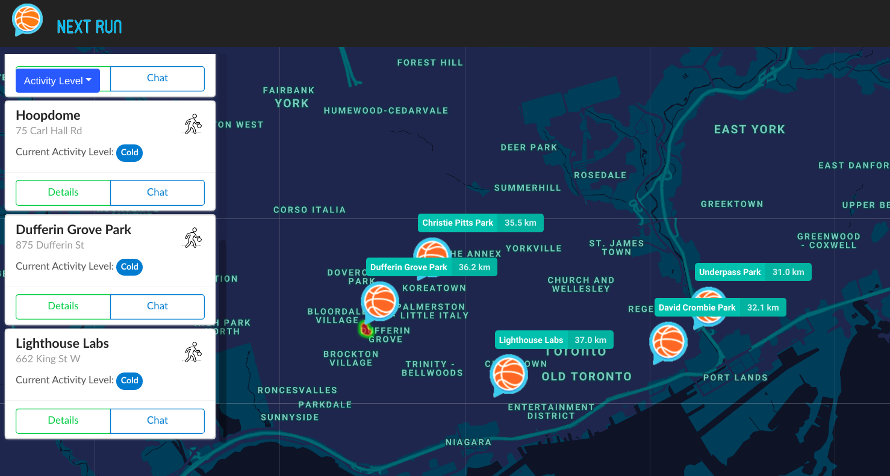
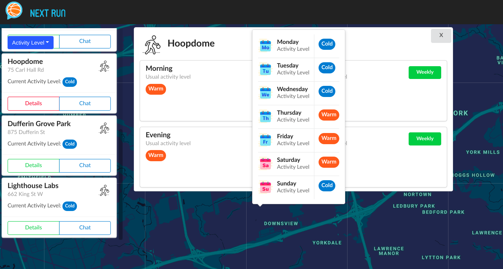
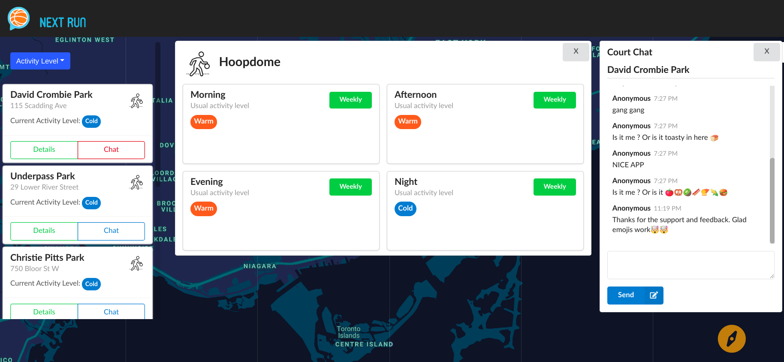
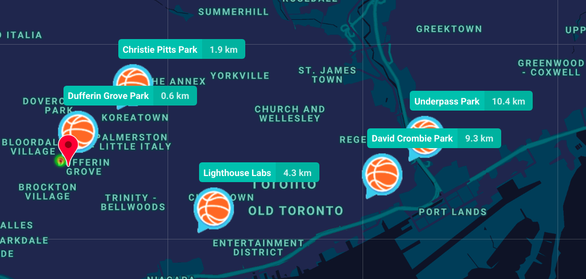
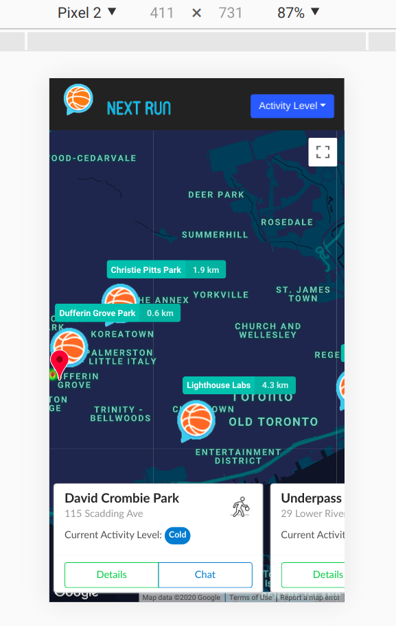
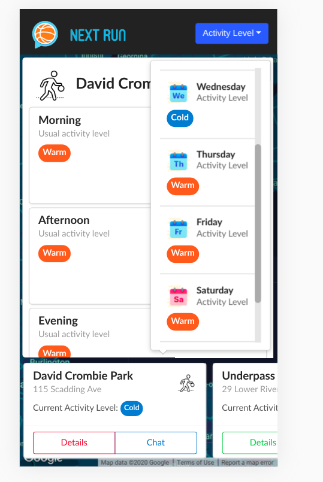
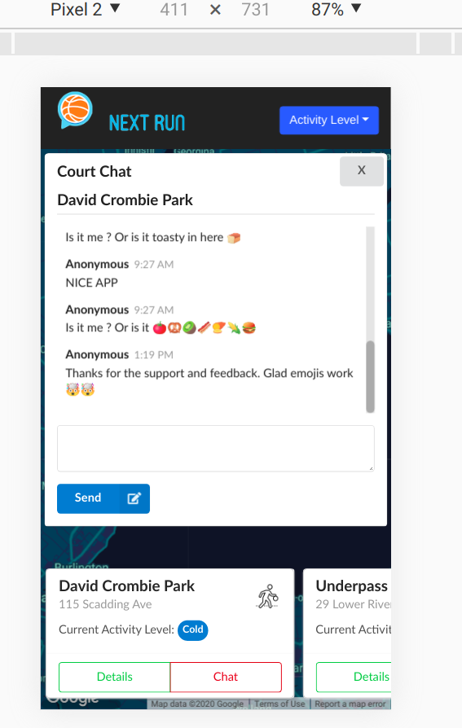

# Next-Run (https://next-run.netlify.com/)

## Introduction

Next-Run is an web application that connects basketball players through real-time communication. It provides live basketball court activity counts via heat maps as well as historical data that tells users when basketball courts are busy. Next-Run is built using ReactJs, Express, Pusher realtime libraries and more.  

## Features
1. Live heatmap data of courts.

2. Basketball court peak times based on historical data

3. Live Chat instances for each court

4. Realtime distance estimations based on current location.

5. Tailored for both web and mobile devices.

## Dependencies
* Axios
* Semantic React Components
* Express Node Js
* React JS
* Push real-time libraries
* Material-React UI

## Getting started
1. Install all dependencies via `npm install`
2. Run using `npm start`